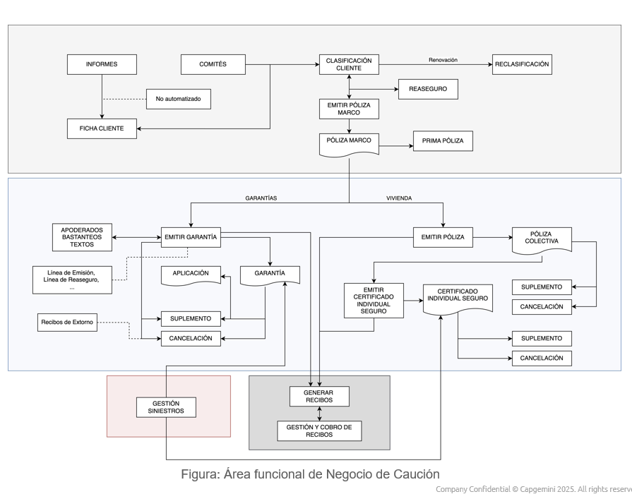
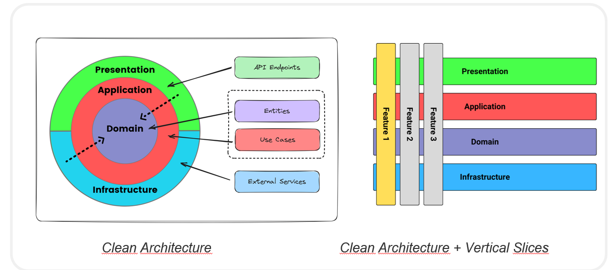
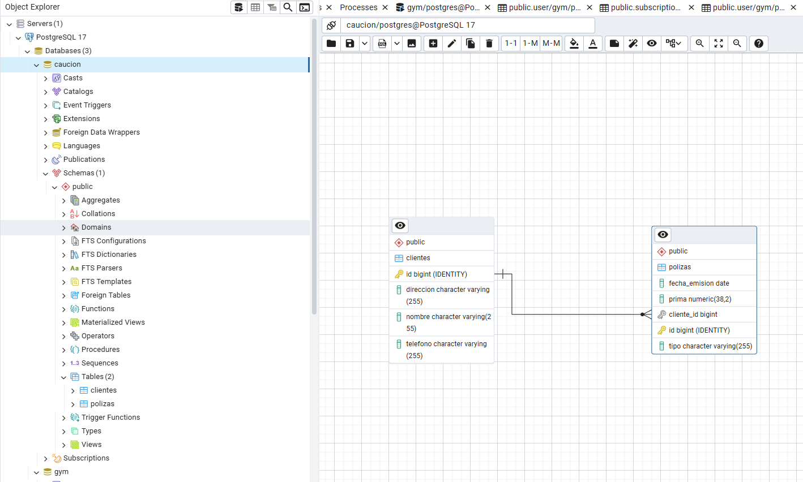

#DIAGRAMA FUNCIONAL

La arquitectura de software, trabajamos en una orientación de clean architecture con vertical slice, 
que nos permite organizar el código por funcionalidad.

#estructura de carpetas

src/
└── main/
└── java/
└── com/
└── solunion/
└── caucion/
├── poliza/
│   └── emitir/
│       ├── api/
│       │   └── EmitirPolizaController.java
│       ├── application/
│       │   ├── EmitirPolizaUseCase.java
│       │   ├── EmitirPolizaCommand.java
│       │   ├── EmitirPolizaResponse.java
│       │   └── mapper/
│       │       └── PolizaMapper.java
│       ├── domain/
│       │   ├── Poliza.java
│       │   ├── Cliente.java
│       │   ├── EstadoPoliza.java
│       │   └── PolizaRepository.java
│       └── infrastructure/
│           └── PolizaJpaRepository.java
└── shared/   <-- opcional: para exceptions, base classes, etc.

Añadimos el CURL:

curl --location 'http://localhost:8087/api/polizas/emitir' \
--header 'Content-Type: application/json' \
--data '{

    "clienteId":  1,
    "tipo": "Seguro de Vida viejo",
    "fechaEmision": "2025-05-14",
    "prima": 1559.75
}'

src/
└── main/
└── java/
└── com/
└── solunion/
└── caucion/
├── poliza/
│   └── emitir/
│       ├── api/
│       │   └── EmitirPolizaController.java
│       ├── application/
│       │   ├── EmitirPolizaUseCase.java
│       │   ├── EmitirPolizaCommand.java
│       │   ├── EmitirPolizaResponse.java
│       │   └── mapper/
│       │       └── PolizaMapper.java
│       ├── domain/
│       │   ├── Poliza.java
│       │   ├── Cliente.java
│       │   ├── EstadoPoliza.java
│       │   ├── valueobjects/
│       │   │   └── PolizaValueObject.java
│       │   └── PolizaRepository.java
│       └── infrastructure/
│           └── PolizaJpaRepository.java
├── informes/
│   └── api/
│       └── InformesController.java
│   ├── application/
│       ├── InformesUseCase.java
│       ├── InformesCommand.java
│       ├── InformesResponse.java
│       └── mapper/
│           └── InformesMapper.java
│   ├── domain/
│       ├── Informe.java
│       ├── Cliente.java
│       ├── valueobjects/
│           └── InformeValueObject.java
│       └── InformeRepository.java
│   └── infrastructure/
│       └── InformeJpaRepository.java
├── comites/
│   └── api/
│       └── ComitesController.java
│   ├── application/
│       ├── ComitesUseCase.java
│       ├── ComitesCommand.java
│       ├── ComitesResponse.java
│       └── mapper/
│           └── ComitesMapper.java
│   ├── domain/
│       ├── Comite.java
│       ├── Cliente.java
│       ├── valueobjects/
│           └── ComiteValueObject.java
│       └── ComiteRepository.java
│   └── infrastructure/
│       └── ComiteJpaRepository.java
├── gestionSiniestros/
│   └── api/
│       └── GestionSiniestrosController.java
│   ├── application/
│       ├── GestionSiniestrosUseCase.java
│       ├── GestionSiniestrosCommand.java
│       ├── GestionSiniestrosResponse.java
│       └── mapper/
│           └── GestionSiniestrosMapper.java
│   ├── domain/
│       ├── Siniestro.java
│       ├── Cliente.java
│       ├── valueobjects/
│           └── SiniestroValueObject.java
│       └── SiniestroRepository.java
│   └── infrastructure/
│       └── SiniestroJpaRepository.java
└── shared/
├── exceptions/
│   └── CustomException.java
├── config/
│   └── AppConfig.java
└── utils/
└── UtilityClass.java

#BBDD POSTGRESS SQL : tabla Clientes y Polizas

#PENDIENTE
1- INTEGRATION (EVENTOS)
    KAKFA/MQ
    RABBIT-MQ
2- SECURITY
    KEYCLOACK
    ACM
    WAF
3- DATA
    AURORA
    REDIS/VALKEY
    DATA LAKE
4- ORCHESTRATION
    AIRFLOW
    STEP FUNCTION
    EVENTBRIDGE
5- API
    CAUCION-API
    API-HUB
    API-HUB-INTERNAL
6- CONFIG
    SECRETS
    PARAMETER
7- NOTIFICATIONS
    SES
8- DNS
   ROUT53
   DNS
9- CLUSTER
    MICRO
